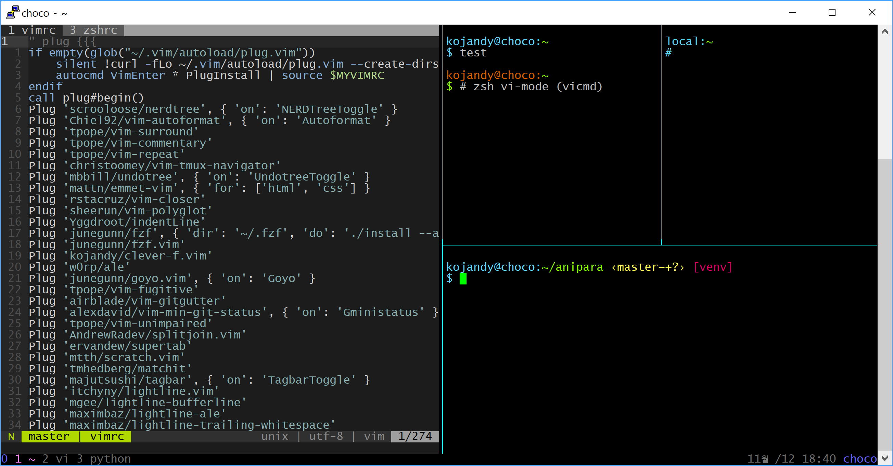

# kojandy's dotfiles



## Installation
### Dependencies
- `curl`
- `git`
- `python3`
- `vim`
- `zsh`

### Recommended
- `tmux`: a terminal multiplexer
- [ripgrep](https://github.com/BurntSushi/ripgrep): ripgrep recursively searches directories for a regex pattern
- [autojump](https://github.com/wting/autojump): A cd command that learns - easily navigate directories from the command line

### Install
```sh
git clone https://github.com/kojandy/.dotfiles.git ~/.dotfiles && cd ~/.dotfiles && ./setup
```
